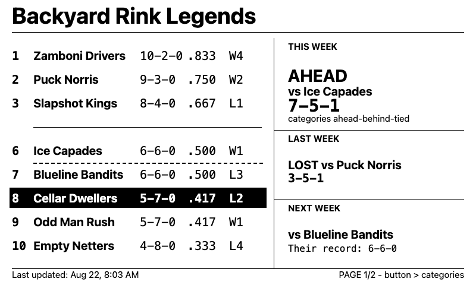
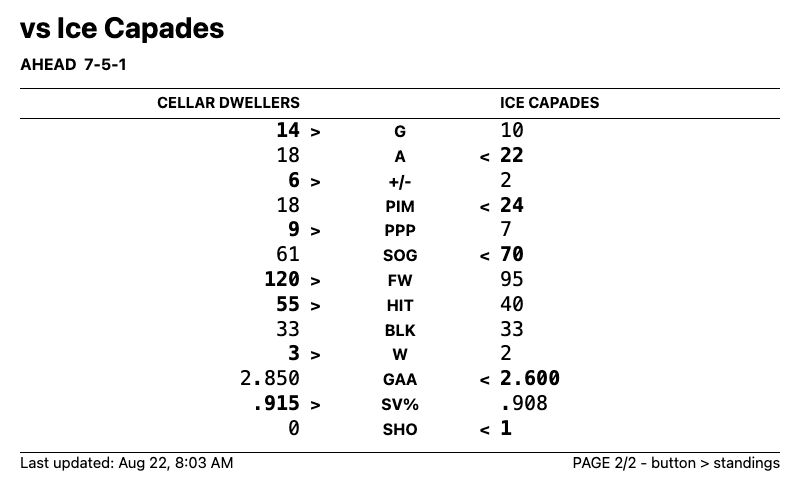

# Fantasy Hockey Scoreboard Firmware

## Display preview

Renders of the 800×480 layout — see
[2026-08-23-standings-display-redesign-design.md](../docs/superpowers/specs/2026-08-23-standings-display-redesign-design.md)
for the full spec. Page 1 is rendered by `renderStandingsPage()` (standings table and matchup sidebar);
page 2 is rendered by `renderCategoryPage()` (head-to-head category breakdown). These are generated
directly from the same drawing logic worked out in the design mockup, not screenshots of running firmware,
but the layout is confirmed working on physical hardware.

| Page 1 — standings + matchup summary | Page 2 — category breakdown |
|---|---|
|  |  |

## Toolchain

```bash
brew install arduino-cli
arduino-cli config init
arduino-cli core update-index
arduino-cli core install esp32:esp32
arduino-cli lib install GxEPD2
arduino-cli lib install ArduinoJson
```

Pinned versions this project was built and verified against:

- `arduino-cli` — 1.5.1
- Core: `esp32:esp32` — 3.3.11
- Libraries: `GxEPD2` (>= 1.6.0 — see design spec for why) — 1.6.9, `ArduinoJson` (^7) — 7.4.3

## One-time setup

1. `cp secrets.h.example secrets.h` and fill in your WiFi credentials, the deployed `/api/standings` URL, the shared token, and your POSIX TZ string.
2. Set driver board DIP switch #1 to "B" (0.47R) for the 7.5" panel. Leave switch #2 on until firmware is stable (it gates the USB-UART bridge needed for flashing).
3. Confirm the board's 24-pin FFC and e-Paper Adapter are present and connect the panel — the driver board ships without a display.

## Build and flash

```bash
arduino-cli compile --fqbn esp32:esp32:esp32 firmware
arduino-cli upload --fqbn esp32:esp32:esp32 -p <serial-port> firmware
```

Find `<serial-port>` via `arduino-cli board list` with the board plugged in. Depending on board revision this may need a CP2102 or CH343 USB-serial driver installed on macOS — check the chip printed on the board if the port doesn't show up.

## Wiring reference

| Signal | GPIO |
|---|---|
| BUSY | 25 |
| RST | 26 |
| DC | 27 |
| CS | 15 |
| CLK/SCK | 13 |
| DIN/MOSI | 14 |

These are fixed by the driver board (no manual wiring needed) but are
non-standard SPI pins — `display_render.cpp` remaps HSPI to match; do not
"simplify" this to a plain `SPI.begin()`.

## Host tests

Three pure modules (`sleep_util`, `display_layout`, and `category_layout`) have no Arduino
dependencies and are tested by compiling them on the host — no board needed:

```bash
clang++ -std=c++17 firmware/test/sleep_util_test.cpp firmware/sleep_util.cpp -o /tmp/sleep_util_test && /tmp/sleep_util_test
clang++ -std=c++17 firmware/test/display_layout_test.cpp firmware/display_layout.cpp firmware/category_layout.cpp -o /tmp/display_layout_test && /tmp/display_layout_test
clang++ -std=c++17 firmware/test/category_layout_test.cpp firmware/category_layout.cpp -o /tmp/category_layout_test && /tmp/category_layout_test
```

Each prints its test names and `OK`, and exits non-zero on failure. Run all three
from the repository root before flashing. Everything else (network, NVS,
panel) needs the manual pass below.

## Host preview

Renders `renderStandingsPage()`/`renderCategoryPage()`/`renderMessage()` — the actual drawing
code, with the actual vendored fonts, not an approximation — against fake data, and writes the
800×480 output to BMP files. No board needed. Requires the Adafruit GFX library installed
locally (already a dependency of the on-device build, via GxEPD2):

```bash
clang++ -std=c++17 -Ifirmware/preview -I"$HOME/Documents/Arduino/libraries/Adafruit_GFX_Library" \
  firmware/preview/preview_main.cpp firmware/display_layout.cpp firmware/category_layout.cpp \
  -o /tmp/preview && /tmp/preview /tmp \
  && for f in /tmp/preview_page1_standings /tmp/preview_page2_categories /tmp/preview_message; do sips -s format png "$f.bmp" --out "$f.png" >/dev/null; done
```

(adjust the second `-I` if `arduino-cli lib install` used a different sketchbook location)

Writes `/tmp/preview_page1_standings.{bmp,png}`, `preview_page2_categories.{bmp,png}`, and
`preview_message.{bmp,png}` (pass a different output directory as the first argument). The BMP
is the tool's native output; the PNG conversion uses macOS's built-in `sips`, so it's
Mac-only — on another OS, open the BMP directly or convert with any image tool.

## Manual on-device verification

Not automatable — run through this after flashing, both on first bring-up
and after any change to `network_api.cpp`, `display_render.cpp`, or `display_render.h`.

Attach a serial monitor at 115200 baud (`arduino-cli monitor -p <serial-port>
-c baudrate=115200`) before powering on — every step below is confirmed from
the log lines the firmware prints.

1. **Happy path:** power on with good WiFi and a reachable `/api/standings`. Expect `WiFi connected`, a `Budget: <n> ms remaining for fetch` line, and `Data source: fresh fetch (<n> rows)`. Confirm the table renders with correct ranks/names/records, the gap divider appears in the right place, and your own team's row is visually highlighted.
2. **WiFi failure:** temporarily wrong `WIFI_PASSWORD` in `secrets.h`. Expect `WiFi connect failed` after ~30s (not hanging), then the display and sleep lines below — the device must deep-sleep rather than staying awake.
3. **API failure with a cache present:** after a successful run (so NVS has cached data), block `STANDINGS_URL` (e.g. wrong `SHARED_TOKEN` temporarily) and expect `Fetch: attempt 1 failed with status 401` followed immediately by `Data source: NVS cache (<n> rows)` — note a 401 is deliberately not retried. Confirm the display shows the previously-cached standings with a "Last updated: ..." footer, not a blank/garbage screen.
4. **Network blackhole / time budget:** point `STANDINGS_URL` at an address that will not respond at all rather than reject the request — e.g. `https://192.0.2.1/api/standings` (`192.0.2.0/24` is reserved for documentation/testing and guaranteed unroutable) — so each attempt has to run out its connect/handshake timeout instead of failing fast. Expect one or more `Fetch: attempt N failed with status -1` lines (or similar connect-failure status), then `Fetch: time budget exhausted, giving up` once no further attempt could finish within the wake-cycle budget — confirm that line appears and the whole cycle still ends in a deep sleep within roughly a minute, not a hang.
5. **Cold start, no cache, API failure:** erase flash (`arduino-cli upload` after `esptool.py erase_flash`, or hold BOOT during a fresh flash) so NVS is empty, then run with a broken `STANDINGS_URL`. Expect `Data source: none, rendering 'No data yet'` and the "No data yet" message on the panel instead of a blank screen.
6. **Panel care:** confirm `Display: hibernating panel` appears at the end of every path above, including the WiFi-failure path in step 2. This is the last thing logged before the sleep lines, so its absence means `hibernate()` was skipped.
7. **Sleep duration sanity:** the last two lines of every run are one of `Sleep: clock synced, scheduling next 8am wake` / `Sleep: clock never synced, using 1h retry fallback`, then `Sleep: sleepMicros=<n> (<h> hours)`. Confirm the value is in a sane range (never near-zero or absurdly large) for a couple of different times-of-day. **Exactly 1.00 hours is legitimate, not a bug:** it is the clock-never-synced fallback, and the preceding line tells you which branch produced the value. With a synced clock expect a few hours up to ~24h depending on time-of-day.
8. **`currentMatchup`/`lastMatchup` both null:** point `STANDINGS_URL` at a payload with both fields `null` (a bye week, or the matchup fetch failing server-side). Confirm the sidebar shows "No matchup this week" and "No result last week" instead of blank space, and the rest of page 1 (table, header, footer) renders normally.
9. **`nextMatchup` null:** same idea for the "NEXT WEEK" block — confirm "No matchup scheduled" renders instead of blank space.
10. **`categories` omitted with `currentMatchup` present:** a payload where `currentMatchup` has `status`/`tally` but an empty `categories` array (settings fetch failed server-side, matchup fetch succeeded). Confirm page 1's sidebar still shows the current matchup normally, and page 2 (via button press) shows "Category breakdown unavailable" instead of an empty or garbled table.
11. **`playoffTeams` absent:** a payload with `playoffTeams: null`. Confirm the standings table renders with no playoff-line divider at all — not a guessed position, not a blank gap.
12. **Physical button — page toggle:** press the button once. Confirm the display redraws near-instantly (no WiFi reconnect, no `Fetching standings...` message) showing the category breakdown page, and the serial log shows `Button wake: switching to page 1`, not a fresh fetch cycle. Press again — confirm it toggles back to page 1.
13. **Physical button — debounce:** hold the button down continuously for several seconds instead of a quick press. Confirm the device doesn't rapidly cycle pages or repeatedly wake — it should toggle once, then wait for release (up to the 2-second debounce cap) before going back to sleep. Note that EXT0 deep-sleep wake is level-triggered, so if the button remains held past the debounce cap and the device re-arms its wake sources, it may wake again almost immediately upon re-entering sleep — this is the known accepted behavior of the current design, not a bug. Release the button to return to normal sleep.
14. **Physical button — daily reset:** after toggling to page 2 via the button, wait for (or force) a normal daily timer wake. Confirm it comes back up on page 1, not wherever the button last left it.
15. **Long opponent name:** point at a payload whose opponent name is very long. Confirm the sidebar's THIS WEEK / LAST WEEK / NEXT WEEK blocks and page 2's header and column header all show a cleanly truncated name that stays inside its region, rather than running into the standings table, off the panel edge, or into the tally line below. Truncation is width-based (`truncateToWidth` in `firmware/display_render.h` measures with `getTextBounds` against the drawing font), so what needs checking is the per-site pixel budget, not a character count. Give page 2's column headers particular attention: they measure the name *after* uppercasing it, so an uppercase name consumes its 280px budget faster than the mixed-case names that budget was originally reasoned about — if any site is going to run tight in practice, it's most likely this one.
16. **Long team name in the standings table:** confirm a long team name in the table's name column does not collide with the W-L-T column that follows it. The name is truncated to a 175px budget measured against `FreeSansBold12pt7b`; if it still crowds the W-L-T column at `wltX`=235, that budget is the thing to adjust.

**Button GPIO provisioning note:** `BUTTON_PIN` is currently `GPIO4`, chosen by reasoning from ESP32 pinout documentation rather than confirmed against the physical board (which is not yet in hand). If the real board's layout rules it out, only that one constant in `firmware/firmware.ino` needs to change.
